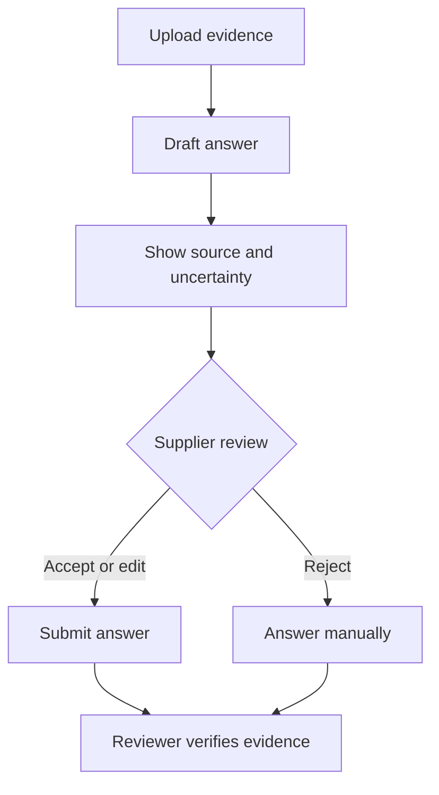

# AI supplier questionnaire — product case study

**Portfolio type:** Public-safe reconstruction of a product problem I worked on in third-party risk management. The documents and example content here are illustrative, not original employer or client materials.

## The problem

Security and compliance questionnaires ask suppliers to answer many similar questions while consulting lengthy policy and audit documents. Repeated manual lookup creates slow turnaround, inconsistent answers, and reviewer effort. The product goal is to draft useful answers from uploaded evidence while keeping suppliers accountable for what they submit.

## Product approach

1. Supplier uploads permitted policy or audit evidence.
2. The system proposes an answer and links the passage supporting it.
3. The interface shows uncertainty and flags questions with missing or conflicting evidence.
4. Supplier accepts, edits, or rejects each suggestion before submission.
5. The reviewer can inspect the answer and cited source; decisions remain auditable.

## My product contribution

My relevant work included translating risk workflow needs into product requirements and user stories, coordinating with design and engineering, supporting delivery and UAT, and shaping enhancements such as source mapping, confidence display, and abbreviation handling. The public documents below demonstrate how I structure these decisions; they are newly written portfolio examples.

## Important decisions

| Decision | Reason |
| --- | --- |
| Show a source passage for each suggestion | A plausible answer without supporting evidence is difficult to verify. |
| Make review an explicit action | A model suggestion should never silently become a supplier attestation. |
| Treat missing/conflicting evidence as an exception | False certainty is more costly than an unanswered item in a risk workflow. |
| Normalize common abbreviations | A document may use a full phrase while a question uses an acronym, or vice versa. |
| Measure quality alongside speed | Faster submission alone could hide weak or unsupported answers. |

## Explore the artifacts

- [Product brief](docs/product-brief.md): scope, users, requirements, and safeguards.
- [User stories and acceptance criteria](docs/user-stories.md): testable behavior.
- [Measurement plan](docs/measurement-plan.md): adoption, speed, quality, and guardrails.
- [Synthetic walkthrough](examples/synthetic-walkthrough.md): an example answer, source passage, and review action.

## Outcome and limitations

The underlying work aimed to reduce supplier effort and turnaround time while making review easier. This public reconstruction contains no company analytics, internal screenshots, or client documents. The example below shows intended behavior, not a live system or independent performance benchmark.
